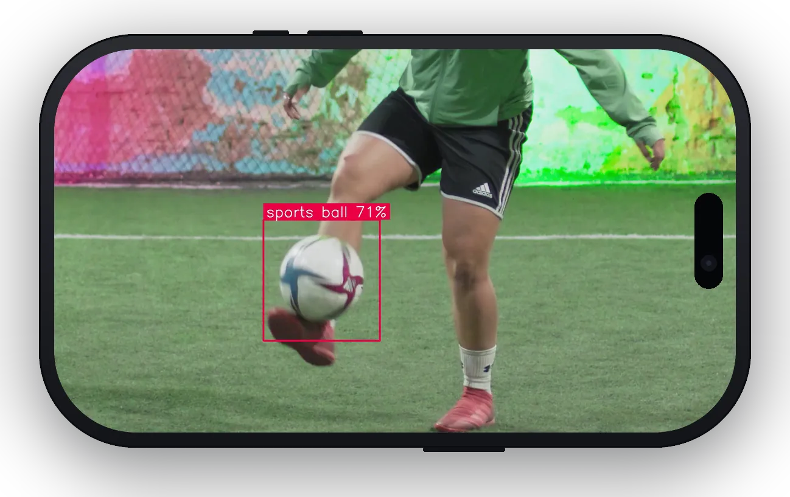

<h1 align="center">object_detection</h1>

<p align="center">
<a href="https://flutter.dev"></a>
<a href="https://dart.dev"></a>
<br>
<a href="https://pub.dev/packages/object_detection"></a>
<a href="https://pub.dev/packages/object_detection/score"></a>
<a href="https://github.com/hugocornellier/object_detection/actions/workflows/build.yml"></a>
<a href="https://github.com/hugocornellier/object_detection/actions/workflows/integration.yml"></a>
<a href="https://github.com/hugocornellier/object_detection/blob/main/LICENSE"></a>
</p>

<p align="center">
  
</p>

Flutter implementation of Google's [MediaPipe Object Detector](https://ai.google.dev/edge/mediapipe/solutions/vision/object_detector) using LiteRT (formerly TensorFlow Lite). Detects 80 COCO object classes (person, car, cat, dog, ...) with bounding boxes and confidence scores. Completely local: no remote API, just pure on-device, offline detection.

## Features

- On-device object detection across 80 COCO classes, runs fully offline
- Bounding boxes + class labels + confidence scores
- Two model variants tradeable for accuracy vs. speed (EfficientDet-Lite0, EfficientDet-Lite2)
- Per-call options: score threshold, max results, category allow / deny lists
- Truly cross-platform: compatible with Android, iOS, macOS, Windows, and Linux
- Background isolate: the UI thread is never blocked during inference
- Live camera support: YUV/BGRA conversion + rotation + downscale all run off the UI thread

## Quick Start

```dart
import 'package:object_detection/object_detection.dart';

Future main() async {
  // Initialize detector, run inference on image
  ObjectDetector detector = await ObjectDetector.create();
  List<DetectedObject> detections = await detector.detect(imageBytes);

  // Iterate through detected objects
  for (final obj in detections) {
    print('${obj.categoryName} (${(obj.score * 100).toStringAsFixed(1)}%) '
          'at (${obj.boundingBox.topLeft.x.toInt()}, '
          '${obj.boundingBox.topLeft.y.toInt()})');
  }

  await detector.dispose();
}
```

Already have bytes (from a file or the network)? Use `detect(imageBytes)`. For live camera streams, use `detectFromCameraImage(...)` (keeps all OpenCV work off the UI thread, see below). For a pre-decoded `cv.Mat`, use `detectFromMat(mat)`.

## Models

All TFLite models are sourced from Google's [MediaPipe](https://ai.google.dev/edge/mediapipe/solutions/vision/object_detector) framework. Google publishes no standalone model card for the EfficientDet-Lite object detectors, so the underlying [EfficientDet paper](https://arxiv.org/abs/1911.09070) is archived in [`doc/model_cards/`](doc/model_cards/):

| Model | File | Input | Best For | Model Card |
|-------|------|-------|----------|------------|
| EfficientDet-Lite0 (default) | `efficientdet_lite0.tflite` | 320×320 | Balanced speed/accuracy | [efficientdet_paper.pdf](doc/model_cards/efficientdet_paper.pdf) · [arXiv 1911.09070](https://arxiv.org/abs/1911.09070) |
| EfficientDet-Lite2 | `efficientdet_lite2.tflite` | 448×448 | Higher accuracy, slower | [efficientdet_paper.pdf](doc/model_cards/efficientdet_paper.pdf) · [arXiv 1911.09070](https://arxiv.org/abs/1911.09070) |

`efficientdet_lite0.tflite` (13,836,895 bytes, SHA-256 `40338edf5ec70d43e318b0a716a84d4564cd1802759a7a07170c7e43796dbf58`) and `efficientdet_lite2.tflite` (23,096,891 bytes, SHA-256 `ad2abbf2b4e10585e15176fd7b5ef03c28dda959ae26fc142549fdd1814db91d`) are byte-identical to Google's official MediaPipe float32 v1 builds ([lite0](https://storage.googleapis.com/mediapipe-models/object_detector/efficientdet_lite0/float32/1/efficientdet_lite0.tflite) · [lite2](https://storage.googleapis.com/mediapipe-models/object_detector/efficientdet_lite2/float32/1/efficientdet_lite2.tflite)). Both models are Apache 2.0 licensed.

Both models output detections over 80 COCO classes (90 entries in the label
map; some are placeholder `???` slots to keep alignment with the original
COCO category IDs).

## Bounding Boxes

The `boundingBox` property returns a `BoundingBox` representing the object bounding box in absolute pixel coordinates. The `BoundingBox` provides convenient access to corner points, dimensions, and center.

### Accessing Corners

```dart
final BoundingBox boundingBox = obj.boundingBox;

// Access individual corners by name (each is a Point with x and y)
final Point topLeft     = boundingBox.topLeft;
final Point topRight    = boundingBox.topRight;
final Point bottomRight = boundingBox.bottomRight;
final Point bottomLeft  = boundingBox.bottomLeft;

print('Top-left: (${topLeft.x}, ${topLeft.y})');
```

### Additional Bounding Box Parameters

```dart
final BoundingBox boundingBox = obj.boundingBox;

final double width  = boundingBox.width;
final double height = boundingBox.height;
final Point center  = boundingBox.center;

print('Size: ${width} x ${height}');
print('Center: (${center.x}, ${center.y})');

// All corners as a list (order: top-left, top-right, bottom-right, bottom-left)
final List<Point> allCorners = boundingBox.corners;
```

## Categories

Each detection carries one or more `Category` objects with the predicted class
index, score, and label string. For object detection the model emits one top
class per box, so `obj.category` gives the dominant class:

```dart
final cat = obj.category;
print('${cat.categoryName} (index ${cat.index}, score ${cat.score})');
```

## Per-call Options

`detect(...)` accepts an optional `ObjectDetectorOptions` for filtering:

```dart
// Threshold + cap
final results = await detector.detect(
  imageBytes,
  options: const ObjectDetectorOptions(
    scoreThreshold: 0.5,
    maxResults: 5,
  ),
);

// Only people and cars
final filtered = await detector.detect(
  imageBytes,
  options: const ObjectDetectorOptions(
    scoreThreshold: 0.4,
    categoryAllowlist: ['person', 'car'],
  ),
);

// Or exclude certain classes
final hideTraffic = await detector.detect(
  imageBytes,
  options: const ObjectDetectorOptions(
    categoryDenylist: ['traffic light', 'stop sign'],
  ),
);
```

`categoryAllowlist` and `categoryDenylist` are mutually exclusive. Pass at
most one.

## Live Camera Detection

For real-time object detection from a camera feed, use `detectFromCameraImage`. All processing runs off the UI thread.

> **Desktop (Windows / macOS / Linux):** The default `camera` package does not include a streaming implementation for desktop platforms. You must also add [`camera_desktop`](https://pub.dev/packages/camera_desktop) to your `pubspec.yaml`, otherwise `startImageStream` throws `UnimplementedError: onStreamedFrameAvailable() is not implemented`.
> ```yaml
> dependencies:
>   camera: ^0.12.0
>   camera_desktop: ^1.2.0   # required for Windows, macOS, and Linux streaming
> ```

```dart
import 'package:camera/camera.dart';
import 'package:object_detection/object_detection.dart';

final detector = await ObjectDetector.create();

final cameras = await availableCameras();
final camera = CameraController(
  cameras.first,
  ResolutionPreset.medium,
  enableAudio: false,
  imageFormatGroup: ImageFormatGroup.yuv420, // prevents JPEG fallback on Android; ignored on desktop
);
await camera.initialize();

camera.startImageStream((CameraImage image) async {
  final detections = await detector.detectFromCameraImage(
    image,
    // rotation: rotationForFrame(...), // recommended on Android/iOS
    options: const ObjectDetectorOptions(scoreThreshold: 0.5, maxResults: 10),
    maxDim: 640,
  );
  // Process detections...
});
```

Tips:
- Pass `rotation:` on Android/iOS so the detector sees upright frames. Use `rotationForFrame(...)` to compute the correct value from sensor orientation and device orientation. On desktop frames are always upright so omit it.
- Pass `maxDim: 640` to downscale frames before inference. Recommended: full-res frames waste bandwidth since the model input is much smaller.
- Mirror the overlay on the front camera to match `CameraPreview`'s auto-mirrored texture.
- For advanced use, `prepareCameraFrame(...)` + `detectFromCameraFrame(...)` is the lower-level two-step API.


### Production pipeline

The snippet above is the minimum. A real live-camera screen also needs to drop
frames it cannot keep up with, track orientation as the device rotates, and map
results onto a preview that is cropped and possibly mirrored. `flutter_litert`
ships all of that, and this package's example app wires it together:

```dart
import 'package:flutter_litert/flutter_litert.dart';

final _throttle = FrameThrottle();   // drop frames while one is in flight
final _fps = FpsCounter();

void _onFrame(CameraImage image) {
  _throttle.run(() async {
    final rotation = rotationForFrame(
      width: image.width,
      height: image.height,
      sensorOrientation: camera.sensorOrientation,
      isFrontCamera: camera.lensDirection == CameraLensDirection.front,
      deviceOrientation: controller.value.deviceOrientation,
    );

    // The coordinate space results come back in. Map the overlay against
    // THIS, not the raw CameraImage size.
    final size = detectionSize(
      width: image.width, height: image.height,
      rotation: rotation, maxDim: 640,
    );

    final objects = await detector.detectFromCameraImage(
      image,
      rotation: rotation,
    options: ObjectDetectorOptions.defaults,
      maxDim: 640,
    );

    if (_fps.tick() && mounted) setState(() => fps = _fps.fps);
    if (mounted) setState(() { this.objects = objects; imageSize = size; });
  });
}
```

And in the overlay painter, one transform handles cover-fit cropping and
front-camera mirroring:

```dart
final t = CoverFitTransform.cover(
  sourceWidth: imageSize.width,
  sourceHeight: imageSize.height,
  viewWidth: size.width,
  viewHeight: size.height,
  mirror: isFrontCamera,
);
canvas.drawCircle(t.map(p.x, p.y), t.scaleLength(3), paint);
```

Without `FrameThrottle`, inference queues behind the stream and the overlay
drifts steadily further behind reality while the frame rate still looks healthy.

### The example app is the reference implementation

The [example app](https://pub.dev/packages/object_detection/example) ships a complete, working live-camera screen
and is the best place to see these pieces used together in real code:

- frame throttling and FPS reporting
- orientation handling across all four device orientations
- front/back camera switching with correct mirroring
- cover-fit overlay mapping via `CoverFitTransform`
- running inference off the UI thread in a detection isolate

`face_detection_tflite`, `pose_detection`, `hand_detection`, and
`object_detection` all follow the same structure, so the pattern transfers
directly between them. See the
[Live camera](https://pub.dev/packages/flutter_litert#live-camera) section of
`flutter_litert` for the underlying helpers.

## Background Processing

All inference runs automatically in a background isolate: the UI thread is never blocked during anchor decoding, NMS, or label resolution. No special configuration is needed; `ObjectDetector` handles isolate management internally.

## Performance

### Inference engines

The package can run inference on either of two LiteRT engines.

| | `Interpreter` (default) | `CompiledModel` (LiteRT Next) |
|---|---|---|
| Enable with | nothing, it is the default | `useCompiledModel: true` |
| Configured by | `performanceConfig` | `accelerators`, `precision` |
| Hardware | platform delegate (see below) | GPU, with automatic CPU fallback |
| Status | GPU/Metal/CoreML delegates are deprecated in `flutter_litert`, slated for removal in 4.0.0 | the forward-looking API |

```dart
// LiteRT Next, GPU with automatic CPU fallback.
final detector = await ObjectDetector.create(useCompiledModel: true);

// LiteRT Next, pinned to CPU.
final detector = await ObjectDetector.create(
  useCompiledModel: true,
  accelerators: {Accelerator.cpu},
);
```

`CompiledModel` is substantially faster wherever a usable GPU exists. Measured
end-to-end through `ObjectDetector.detect()` on macOS (Apple Silicon, debug
build), same process, same images:

| Model | `Interpreter` | `CompiledModel` | Speedup |
|-------|--------------|-----------------|---------|
| Lite0 | 10.7-11.9 ms | 5.0-8.8 ms | 1.3-2.1x |
| Lite2 | 29.4-30.4 ms | 8.9-10.9 ms | 2.8-3.3x |

The two engines agree on what they detect. GPU fp16 arithmetic shifts scores by
roughly 1e-3, which is occasionally enough to swap the rank of two detections
whose scores are tied to three decimals.

The package default is deliberately left on the `Interpreter` path, matching
the other LiteRT demo packages, so adding `object_detection` to an app never
silently changes its inference engine. Opt in per detector once you have
measured it on your target hardware.

The **example app** does default to `CompiledModel`, and every screen carries a
`CM` / `XNN` badge that switches engines live so you can compare them against
the reported inference time. If `CompiledModel` cannot be created on the
device, the example falls back to the `Interpreter` engine and the badge
reports what is actually running.

### Hardware Acceleration

On the `Interpreter` path the package automatically selects the best
acceleration strategy for each platform:

| Platform | Default Delegate | Speedup | Notes |
|----------|-----------------|---------|-------|
| **macOS** | XNNPACK | 2-5x | SIMD vectorization (NEON on ARM, AVX on x86) |
| **Linux** | XNNPACK | 2-5x | SIMD vectorization |
| **iOS** | Metal GPU | 2-4x | Hardware GPU acceleration |
| **Android** | XNNPACK | 2-5x | ARM NEON SIMD acceleration |
| **Windows** | XNNPACK | 2-5x | SIMD vectorization (AVX on x86) |

No configuration needed: just call `ObjectDetector.create()` (or `initialize()`) and you get the optimal performance for your platform.

### Measured latency

Median per-image latency on `cat.jpg` (640×480) with EfficientDet-Lite0 after warm-up:

| Platform | Median |
|----------|--------|
| macOS host (Apple Silicon) | ~31 ms |
| iPhone 16 Pro simulator | ~40 ms |
| Android emulator (Pixel 8, API 36) | ~41 ms |

### Reproducing these numbers

The example app ships the benchmark suite used for every figure above:

```bash
cd example
flutter test integration_test/object_detector_benchmark_test.dart -d macos  # e2e + per-stage
flutter test integration_test/stage_attribution_test.dart -d macos          # invoke vs decode vs NMS
flutter test integration_test/engine_sweep_test.dart -d macos               # every delegate and engine
flutter test integration_test/compiledmodel_ab_test.dart -d macos           # engine A/B + agreement
```

Each case prints a `BENCH_JSON` line for machine diffing alongside the
human-readable summary.

### Advanced Performance Configuration

The `performanceConfig` parameter works on both `create()` and `initialize()`.

```dart
// Auto mode (default): optimal for each platform
final detector = await ObjectDetector.create();
// Equivalent to:
final detector = await ObjectDetector.create(
  performanceConfig: PerformanceConfig.auto(),
);

// Force XNNPACK (all native platforms)
final detector = await ObjectDetector.create(
  performanceConfig: PerformanceConfig.xnnpack(numThreads: 4),
);

// Force GPU delegate (iOS recommended, Android experimental)
final detector = await ObjectDetector.create(
  performanceConfig: PerformanceConfig.gpu(),
);

// CPU-only (maximum compatibility)
final detector = await ObjectDetector.create(
  performanceConfig: PerformanceConfig.disabled,
);
```

### Advanced: Direct Mat Input

For live camera streams, you can bypass image encoding/decoding entirely by passing a `Mat` directly to `detectFromMat()`:

```dart
import 'package:object_detection/object_detection.dart';

Future<void> processFrame(Mat frame) async {
  final detector = await ObjectDetector.create();

  // Direct Mat input: fastest for video streams
  final detections = await detector.detectFromMat(frame);

  frame.dispose(); // always dispose Mats after use
  await detector.dispose();
}
```

**When to use `Mat` input:**
- You already have a decoded `cv.Mat` from another OpenCV pipeline
- You need to preprocess images with OpenCV before detection

For live camera streams, prefer `detectFromCameraImage(...)`: it keeps all `cvtColor` / `rotate` / downscale work inside the detection isolate rather than on the UI thread.

**For all other cases**, pass image bytes (`Uint8List`) to `detect()`.

### Advanced: Raw Pixel Bytes Input

If you already have raw pixel data as a `Uint8List` (e.g. from an isolate worker or image processing pipeline), use `detectFromMatBytes()` to skip constructing a `cv.Mat` on the calling thread entirely:

```dart
final Uint8List rawPixels = ...;
final int width = 1920;
final int height = 1080;

final detections = await detector.detectFromMatBytes(
  rawPixels,
  width: width,
  height: height,
  // matType: 16 (CV_8UC3/BGR) is the default
);
```

This is the fastest path when you already have raw pixel bytes: the data is transferred to the background isolate via zero-copy `TransferableTypedData`, and the `cv.Mat` is reconstructed there instead of on the calling thread.

### Memory Considerations

`ObjectDetector` holds the TFLite model (~14 MB for EfficientDet-Lite0, ~24 MB for Lite2) in a background isolate. Always call `dispose()` when finished to release these resources. Image data is transferred using zero-copy `TransferableTypedData`, minimizing memory overhead.

## Example

The [sample code](https://pub.dev/packages/object_detection/example) from the pub.dev example tab includes a Flutter app demonstrating:

- Bounding boxes with class labels and confidence scores
- Compare `efficientDetLite0` and `efficientDetLite2` models side-by-side
- Adjustable score threshold and max-results sliders
- Real-time inference timing display

## Inspiration

This package is built on top of Google's [MediaPipe Object Detector](https://ai.google.dev/edge/mediapipe/solutions/vision/object_detector) models and structurally mirrors the sister plugin **[face_detection_tflite](https://pub.dev/packages/face_detection_tflite)**, sharing the same isolate-based architecture, performance configuration, camera frame handling, and OpenCV/LiteRT pipeline.
